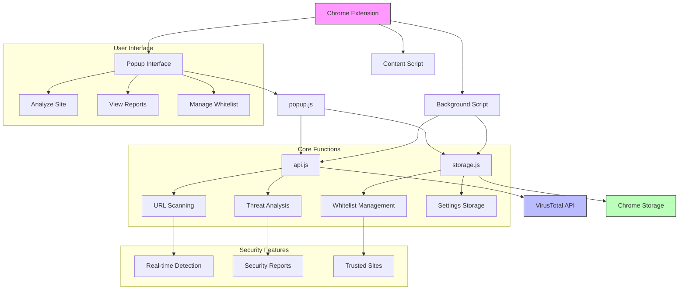

# SiteWarn Extension

A Chrome extension that helps users identify potentially dangerous websites using the VirusTotal API.

## 🎯 Purpose

This project was developed with multiple learning objectives:
- Integration with external APIs (VirusTotal)
- Chrome Extension Development
- Clean Code practices in JavaScript
- Modern JavaScript features (ES6+)
- Async/await patterns
- Promise handling
- HTML/CSS best practices
- Local storage management

## 🛠️ Features

- Real-time website security analysis
- Malicious content detection
- Trusted sites management
- Detailed security reports
- User-friendly popup interface
- Site whitelist functionality

## 🏗️ Project Structure

```
SiteWarnExtension/
├── assets/
│   ├── analyze.png
│   ├── safe.png
│   └── warning.png
├── popup/
│   ├── popup.html
│   ├── popup.css
│   └── popup.js
├── scripts/
│   ├── api.js
│   └── storage.js
├── background.js
├── content.js
├── manifest.json
└── LICENSE
```

## 📊 Project Architecture



Esta arquitetura representa o fluxo de dados e a interação entre os diferentes componentes da extensão:
- Interface do usuário através do popup
- Scripts de background e content para funcionamento da extensão
- Integração com a API do VirusTotal
- Gerenciamento de armazenamento local
- Recursos de segurança e análise

## 🚀 Installation

1. Clone this repository
2. Open Chrome and navigate to `chrome://extensions/`
3. Enable "Developer mode" in the top right
4. Click "Load unpacked" and select the project folder

## 💻 How to Use

1.Get a free API key from the [VirusTotal](https://www.virustotal.com/gui/join-us) website
2.Open the scripts/api.js file and insert your API key
3.Click the SiteWarn icon in the Chrome toolbar
4.Press "Scan Current Site" to analyze the active page
5.View the security scan results
6.Optionally, add trusted websites to your whitelist

## ⚙️ Technical Details

### API Integration
- Uses VirusTotal API v3
- Implements URL scanning and analysis
- Handles asynchronous API responses

### Storage Management
- Chrome's local storage for trusted sites
- Persistent site whitelist
- Efficient domain management

### Security Features
- Real-time threat detection
- Malicious content filtering
- User confirmation dialogs
- Detailed security reports

## 🔒 Privacy

- No personal data collection
- Local storage only for trusted sites
- API key restrictions in place
- Secure communication protocols

## 🤝 Contributing

Feel free to contribute to this project by:
1. Forking the repository
2. Creating a feature branch
3. Submitting a pull request

## 📄 License

This project is licensed under the MIT License - see the [LICENSE](LICENSE) file for details.

---

[🇧🇷 Versão em Português](README.pt-br.md)
