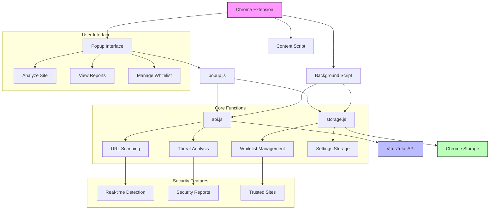

# SiteWarn Extension

Uma extensão Chrome que ajuda usuários a identificar websites potencialmente perigosos usando a API do VirusTotal.

## 🎯 Propósito

Este projeto foi desenvolvido com múltiplos objetivos de aprendizado:
- Integração com APIs externas (VirusTotal)
- Desenvolvimento de Extensões Chrome
- Práticas de Código Limpo em JavaScript
- Recursos modernos do JavaScript (ES6+)
- Padrões async/await
- Manipulação de Promises
- Boas práticas de HTML/CSS
- Gerenciamento de armazenamento local

## 🛠️ Funcionalidades

- Análise de segurança de websites em tempo real
- Detecção de conteúdo malicioso
- Gerenciamento de sites confiáveis
- Relatórios detalhados de segurança
- Interface popup amigável
- Funcionalidade de lista branca de sites

## 🏗️ Estrutura do Projeto

```
SiteWarnExtension/
├── assets/
│   ├── analyze.png
│   ├── safe.png
│   └── warning.png
├── popup/
│   ├── popup.html
│   ├── popup.css
│   └── popup.js
├── scripts/
│   ├── api.js
│   └── storage.js
├── background.js
├── content.js
├── manifest.json
└── LICENSE
```
## 📊 Arquitetura do Projeto



## 🚀 Instalação

1. Clone este repositório
2. Abra o Chrome e navegue até `chrome://extensions/`
3. Ative o "Modo desenvolvedor" no canto superior direito
4. Clique em "Carregar sem compactação" e selecione a pasta do projeto

## 💻 Como Usar

1. Obtenha uma chave API gratuita no site do [VirusTotal](https://www.virustotal.com/gui/join-us)
2. Abra o arquivo [`scripts/api.js`](scripts/api.js) e insira sua chave API:
3. Clique no ícone do SiteWarn na barra de ferramentas do Chrome
4. Pressione "Analisar Site Atual" para escanear a página ativa
5. Visualize os resultados da análise de segurança
6. Opcionalmente, adicione sites confiáveis à sua lista branca

## ⚙️ Detalhes Técnicos

### Integração com API
- Utiliza API V3 do VirusTotal
- Implementa escaneamento e análise de URLs
- Gerencia respostas assíncronas da API

### Gerenciamento de Armazenamento
- Armazenamento local do Chrome para sites confiáveis
- Lista branca persistente
- Gerenciamento eficiente de domínios

### Recursos de Segurança
- Detecção de ameaças em tempo real
- Filtragem de conteúdo malicioso
- Diálogos de confirmação do usuário
- Relatórios detalhados de segurança

## 🔒 Privacidade

- Sem coleta de dados pessoais
- Armazenamento local apenas para sites confiáveis
- Restrições de chave API implementadas
- Protocolos seguros de comunicação

## 🤝 Contribuindo

Sinta-se à vontade para contribuir com este projeto:
1. Faça um fork do repositório
2. Crie um branch para sua feature
3. Envie um pull request

## 📄 Licença

Este projeto está licenciado sob a Licença MIT - veja o arquivo [LICENSE](LICENSE) para detalhes.

---

[🇺🇸 English Version](README.md)
---